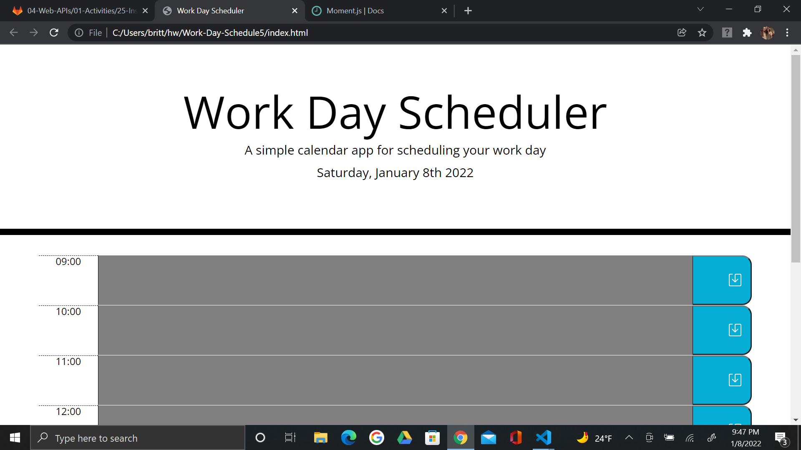
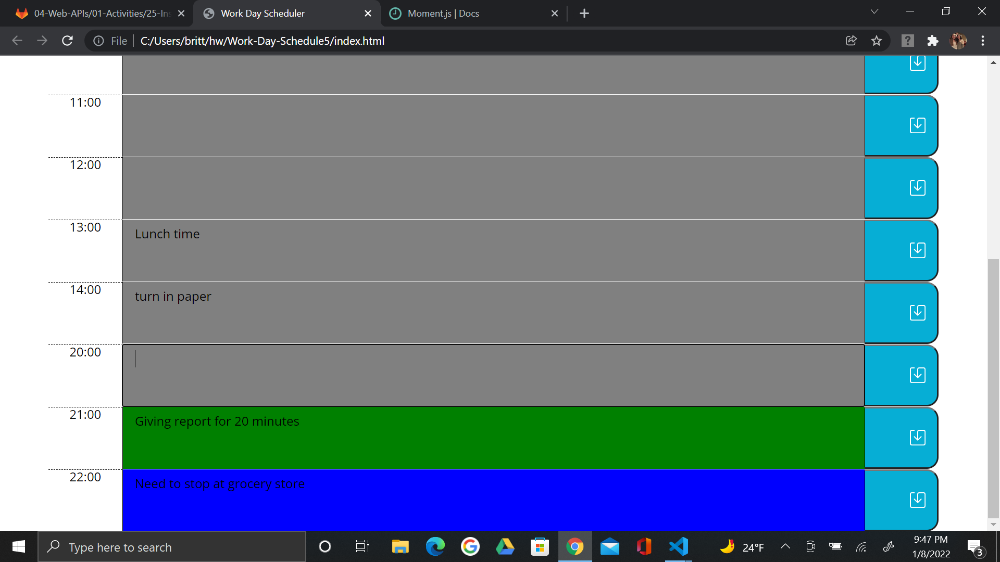

# Work-Day-Schedule5

# Description:
This Application allows the user to keep track of their day, by the hour, for a typical 9am to 5pm work day. The planner is color coordinated by hour, using a 24 hour clock. To elaborate, the hours of that day that are past will be grey, the current hour/time will be green, and hours to come (future) will be blue. The user can click into the time blocks and add in events or tasks. Each block has a save button on the end; which will save the data to the local storage. When the user refreshes the page, their tasks entries will still be saved on the page. 

# Application
This webpage was created using the following
    - html
    - CSS 
    - Bootstrap
    - JavaScript

Click the link to see page in use or view the following screenshot
https://britt-klose.github.io/Work-Day-Schedule5/  

